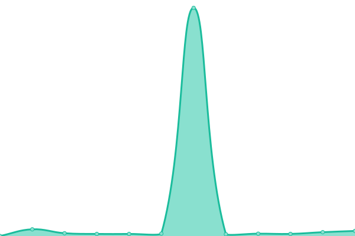
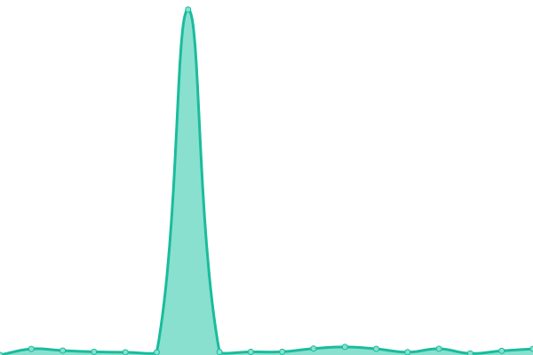
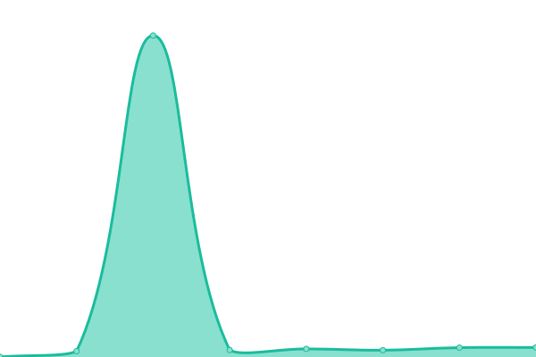
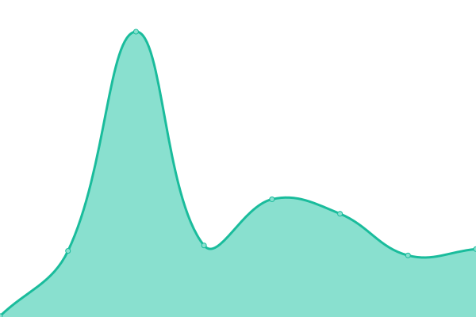
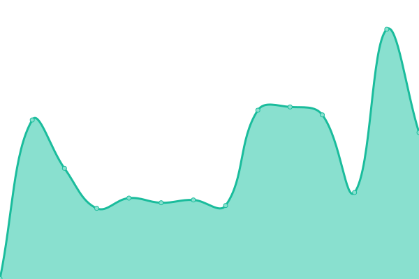
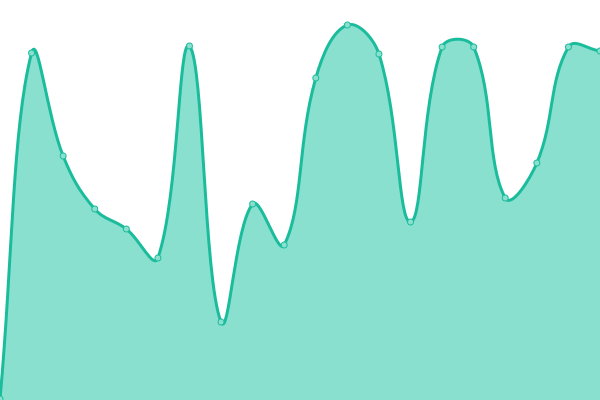
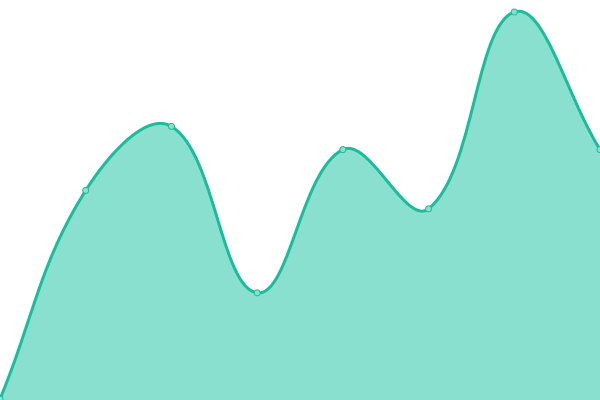
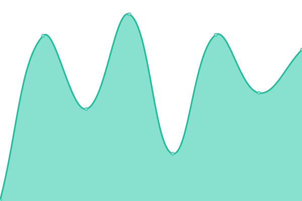

# [📈 Live Status](https://status-01.dataforcanada.org): <!--live status--> **🟧 Partial outage**

This repository contains the open-source uptime monitor and status page for [Data for Canada](https://www.dataforcanada.org), powered by [Upptime](https://github.com/upptime/upptime).

With [Upptime](https://upptime.js.org), you can get your own unlimited and free uptime monitor and status page, powered entirely by a GitHub repository. We use [Issues](https://github.com/dataforcanada/status-01.dataforcanada.org/issues) as incident reports, [Actions](https://github.com/dataforcanada/status-01.dataforcanada.org/actions) as uptime monitors, and [Pages](https://status-01.dataforcanada.org) for the status page.

<!--start: status pages-->
<!-- This summary is generated by Upptime (https://github.com/upptime/upptime) -->
<!-- Do not edit this manually, your changes will be overwritten -->
<!-- prettier-ignore -->
| URL | Status | History | Response Time | Uptime |
| --- | ------ | ------- | ------------- | ------ |
|  [Main Website](https://www.dataforcanada.org) | 🟩 Up | [main-website.yml](https://github.com/dataforcanada/status.dataforcanada.org/commits/HEAD/history/main-website.yml) | 

 415ms
     
 | 

<a href="https://status.dataforcanada.org/history/main-website">100.00%</a>
    

|  [Production Ready Data](https://data-01.dataforcanada.org) | 🟩 Up | [production-ready-data.yml](https://github.com/dataforcanada/status.dataforcanada.org/commits/HEAD/history/production-ready-data.yml) | 

 434ms
     
 | 

<a href="https://status.dataforcanada.org/history/production-ready-data">100.00%</a>
    

|  [Data in the Lab](https://data-01.labs.dataforcanada.org) | 🟩 Up | [data-in-the-lab.yml](https://github.com/dataforcanada/status.dataforcanada.org/commits/HEAD/history/data-in-the-lab.yml) | 

 0ms
     
 | 

<a href="https://status.dataforcanada.org/history/data-in-the-lab">100.00%</a>
    

|  [Data in the Lab](https://data-01.labs.dataforcanada.org) | 🟩 Up | [data-in-the-lab.yml](https://github.com/dataforcanada/status.dataforcanada.org/commits/HEAD/history/data-in-the-lab.yml) | 

 0ms
     
 | 

<a href="https://status.dataforcanada.org/history/data-in-the-lab">100.00%</a>
    

|  [Panoramax (Prod)](https://panoramax-01.dataforcanada.org) | 🟩 Up | [panoramax-prod.yml](https://github.com/dataforcanada/status.dataforcanada.org/commits/HEAD/history/panoramax-prod.yml) | 

 322ms
     
 | 

<a href="https://status.dataforcanada.org/history/panoramax-prod">100.00%</a>
    

|  [Panoramax (Labs)](https://panoramax-01.labs.dataforcanada.org) | 🟩 Up | [panoramax-labs.yml](https://github.com/dataforcanada/status.dataforcanada.org/commits/HEAD/history/panoramax-labs.yml) | 

 454ms
     
 | 

<a href="https://status.dataforcanada.org/history/panoramax-labs">100.00%</a>
    

|  [GeoServer (Prod)](https://geoserver-01.dataforcanada.org) | 🟩 Up | [geo-server-prod.yml](https://github.com/dataforcanada/status.dataforcanada.org/commits/HEAD/history/geo-server-prod.yml) | 

 357ms
     
 | 

<a href="https://status.dataforcanada.org/history/geo-server-prod">100.00%</a>
    

|  [GeoServer (Labs)](https://geoserver-01.labs.dataforcanada.org) | 🟩 Up | [geo-server-labs.yml](https://github.com/dataforcanada/status.dataforcanada.org/commits/HEAD/history/geo-server-labs.yml) | 

 341ms
     
 | 

<a href="https://status.dataforcanada.org/history/geo-server-labs">100.00%</a>
    

|  [ZOO-Project (Prod)](https://zoo-project-01.dataforcanada.org) | 🟩 Up | [zoo-project-prod.yml](https://github.com/dataforcanada/status.dataforcanada.org/commits/HEAD/history/zoo-project-prod.yml) | 

 568ms
     
 | 

<a href="https://status.dataforcanada.org/history/zoo-project-prod">100.00%</a>
    

|  [ZOO-Project (Labs)](https://zoo-project-01.labs.dataforcanada.org) | 🟩 Up | [zoo-project-labs.yml](https://github.com/dataforcanada/status.dataforcanada.org/commits/HEAD/history/zoo-project-labs.yml) | 

 342ms
     
 | 

<a href="https://status.dataforcanada.org/history/zoo-project-labs">100.00%</a>
    

|  [Tile Server (Prod)](https://tiles-01.dataforcanada.org) | 🟥 Down | [tile-server-prod.yml](https://github.com/dataforcanada/status.dataforcanada.org/commits/HEAD/history/tile-server-prod.yml) | 

 103ms
     
 | 

<a href="https://status.dataforcanada.org/history/tile-server-prod">0.00%</a>
    

|  [Tile Server (Labs)](https://tiles-01.labs.dataforcanada.org) | 🟥 Down | [tile-server-labs.yml](https://github.com/dataforcanada/status.dataforcanada.org/commits/HEAD/history/tile-server-labs.yml) | 

 74ms
     
 | 

<a href="https://status.dataforcanada.org/history/tile-server-labs">0.00%</a>
    

|  [BitTorrent Tracker](https://tracker.dataforcanada.org) | 🟩 Up | [bit-torrent-tracker.yml](https://github.com/dataforcanada/status.dataforcanada.org/commits/HEAD/history/bit-torrent-tracker.yml) | 

 237ms
     
 | 

<a href="https://status.dataforcanada.org/history/bit-torrent-tracker">100.00%</a>
    

|  [Torrent Index (Prod)](https://index.dataforcanada.org) | 🟩 Up | [torrent-index-prod.yml](https://github.com/dataforcanada/status.dataforcanada.org/commits/HEAD/history/torrent-index-prod.yml) | 

 342ms
     
 | 

<a href="https://status.dataforcanada.org/history/torrent-index-prod">100.00%</a>
    

|  [Torrent Index (Labs)](https://index.labs.dataforcanada.org) | 🟩 Up | [torrent-index-labs.yml](https://github.com/dataforcanada/status.dataforcanada.org/commits/HEAD/history/torrent-index-labs.yml) | 

 347ms
     
 | 

<a href="https://status.dataforcanada.org/history/torrent-index-labs">100.00%</a>
    

|  [Static Assets (Prod)](https://static-01.dataforcanada.org) | 🟥 Down | [static-assets-prod.yml](https://github.com/dataforcanada/status.dataforcanada.org/commits/HEAD/history/static-assets-prod.yml) | 

 0ms
     
 | 

<a href="https://status.dataforcanada.org/history/static-assets-prod">0.00%</a>
    

|  [Static Assets (Labs)](https://static-01.labs.dataforcanada.org) | 🟥 Down | [static-assets-labs.yml](https://github.com/dataforcanada/status.dataforcanada.org/commits/HEAD/history/static-assets-labs.yml) | 

 0ms
     
 | 

<a href="https://status.dataforcanada.org/history/static-assets-labs">0.09%</a>
    

|  [Git / Source Code](https://git.dataforcanada.org) | 🟥 Down | [git-source-code.yml](https://github.com/dataforcanada/status.dataforcanada.org/commits/HEAD/history/git-source-code.yml) | 

 0ms
     
 | 

<a href="https://status.dataforcanada.org/history/git-source-code">0.00%</a>
    

<!--end: status pages-->

[**Visit our status website →**](https://status-01.dataforcanada.org)

## 📄 License

- Powered by: [Upptime](https://github.com/upptime/upptime)
- Code: [MIT](./LICENSE) © [Anand Chowdhary](https://anandchowdhary.com), supported by [Pabio](https://pabio.com)
- Data in the `./history` directory: [Open Database License](https://opendatacommons.org/licenses/odbl/1-0/)
