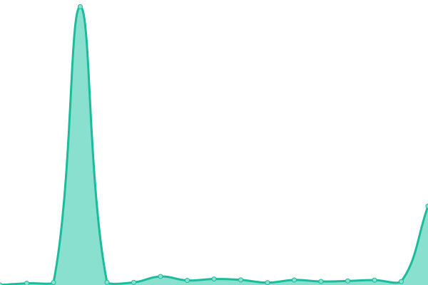
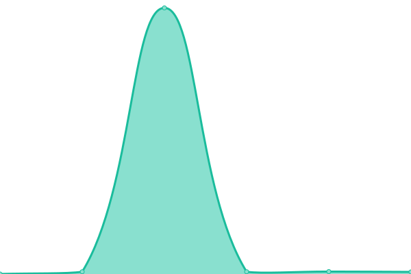

# [📈 Live Status](https://status-01.dataforcanada.org): <!--live status--> **🟩 All systems operational**

This repository contains the open-source uptime monitor and status page for [Data for Canada](https://www.dataforcanada.org), powered by [Upptime](https://github.com/upptime/upptime).

With [Upptime](https://upptime.js.org), you can get your own unlimited and free uptime monitor and status page, powered entirely by a GitHub repository. We use [Issues](https://github.com/dataforcanada/status-01.dataforcanada.org/issues) as incident reports, [Actions](https://github.com/dataforcanada/status-01.dataforcanada.org/actions) as uptime monitors, and [Pages](https://status-01.dataforcanada.org) for the status page.

<!--start: status pages-->
<!-- This summary is generated by Upptime (https://github.com/upptime/upptime) -->
<!-- Do not edit this manually, your changes will be overwritten -->
<!-- prettier-ignore -->
| URL | Status | History | Response Time | Uptime |
| --- | ------ | ------- | ------------- | ------ |
|  [Main Website](https://www.dataforcanada.org) | 🟩 Up | [main-website.yml](https://github.com/dataforcanada/status.dataforcanada.org/commits/HEAD/history/main-website.yml) | 

 284ms
     
 | 

<a href="https://status.dataforcanada.org/history/main-website">100.00%</a>
    

|  [BitTorrent Tracker](https://tracker.dataforcanada.org) | 🟩 Up | [bit-torrent-tracker.yml](https://github.com/dataforcanada/status.dataforcanada.org/commits/HEAD/history/bit-torrent-tracker.yml) | 

 194ms
     
 | 

<a href="https://status.dataforcanada.org/history/bit-torrent-tracker">92.32%</a>
    

|  [Production Ready Data](https://data-01.dataforcanada.org) | 🟩 Up | [production-ready-data.yml](https://github.com/dataforcanada/status.dataforcanada.org/commits/HEAD/history/production-ready-data.yml) | 

 304ms
     
 | 

<a href="https://status.dataforcanada.org/history/production-ready-data">100.00%</a>
    

|  [Data in the Lab](https://data-01.labs.dataforcanada.org) | 🟩 Up | [data-in-the-lab.yml](https://github.com/dataforcanada/status.dataforcanada.org/commits/HEAD/history/data-in-the-lab.yml) | 

 0ms
     
 | 

<a href="https://status.dataforcanada.org/history/data-in-the-lab">98.10%</a>
    

|  [Static Assets (Prod)](https://static-01.dataforcanada.org) | 🟩 Up | [static-assets-prod.yml](https://github.com/dataforcanada/status.dataforcanada.org/commits/HEAD/history/static-assets-prod.yml) | 

 257ms
     
 | 

<a href="https://status.dataforcanada.org/history/static-assets-prod">81.09%</a>
    

|  [Static Assets (Labs)](https://static-01.labs.dataforcanada.org) | 🟩 Up | [static-assets-labs.yml](https://github.com/dataforcanada/status.dataforcanada.org/commits/HEAD/history/static-assets-labs.yml) | 

 233ms
     
 | 

<a href="https://status.dataforcanada.org/history/static-assets-labs">81.09%</a>
    

|  [Tile Server (Prod)](https://tiles-01.dataforcanada.org) | 🟩 Up | [tile-server-prod.yml](https://github.com/dataforcanada/status.dataforcanada.org/commits/HEAD/history/tile-server-prod.yml) | 

 117ms
     
 | 

<a href="https://status.dataforcanada.org/history/tile-server-prod">72.64%</a>
    

|  [Tile Server (Labs)](https://tiles-01.labs.dataforcanada.org) | 🟩 Up | [tile-server-labs.yml](https://github.com/dataforcanada/status.dataforcanada.org/commits/HEAD/history/tile-server-labs.yml) | 

 83ms
     
 | 

<a href="https://status.dataforcanada.org/history/tile-server-labs">72.63%</a>
    

|  [Panoramax (Prod)](https://panoramax-01.dataforcanada.org) | 🟩 Up | [panoramax-prod.yml](https://github.com/dataforcanada/status.dataforcanada.org/commits/HEAD/history/panoramax-prod.yml) | 

 2044ms
     
 | 

<a href="https://status.dataforcanada.org/history/panoramax-prod">92.70%</a>
    

|  [Panoramax (Labs)](https://panoramax-01.labs.dataforcanada.org) | 🟩 Up | [panoramax-labs.yml](https://github.com/dataforcanada/status.dataforcanada.org/commits/HEAD/history/panoramax-labs.yml) | 

 282ms
     
 | 

<a href="https://status.dataforcanada.org/history/panoramax-labs">100.00%</a>
    

|  [Martin (Prod)](https://martin-01.dataforcanada.org) | 🟩 Up | [martin-prod.yml](https://github.com/dataforcanada/status.dataforcanada.org/commits/HEAD/history/martin-prod.yml) | 

 3016ms
     
 | 

<a href="https://status.dataforcanada.org/history/martin-prod">89.24%</a>
    

|  [Martin (Labs)](https://martin-01.labs.dataforcanada.org) | 🟩 Up | [martin-labs.yml](https://github.com/dataforcanada/status.dataforcanada.org/commits/HEAD/history/martin-labs.yml) | 

 2962ms
     
 | 

<a href="https://status.dataforcanada.org/history/martin-labs">89.83%</a>
    

|  [Pelias (Prod)](https://pelias-01.dataforcanada.org) | 🟩 Up | [pelias-prod.yml](https://github.com/dataforcanada/status.dataforcanada.org/commits/HEAD/history/pelias-prod.yml) | 

 3454ms
     
 | 

<a href="https://status.dataforcanada.org/history/pelias-prod">89.74%</a>
    

|  [Pelias (Labs)](https://pelias-01.labs.dataforcanada.org) | 🟩 Up | [pelias-labs.yml](https://github.com/dataforcanada/status.dataforcanada.org/commits/HEAD/history/pelias-labs.yml) | 

 3404ms
     
 | 

<a href="https://status.dataforcanada.org/history/pelias-labs">100.00%</a>
    

|  [GeoServer (Prod)](https://geoserver-01.dataforcanada.org) | 🟩 Up | [geo-server-prod.yml](https://github.com/dataforcanada/status.dataforcanada.org/commits/HEAD/history/geo-server-prod.yml) | 

 2161ms
     
 | 

<a href="https://status.dataforcanada.org/history/geo-server-prod">100.00%</a>
    

|  [GeoServer (Labs)](https://geoserver-01.labs.dataforcanada.org) | 🟩 Up | [geo-server-labs.yml](https://github.com/dataforcanada/status.dataforcanada.org/commits/HEAD/history/geo-server-labs.yml) | 

 2155ms
     
 | 

<a href="https://status.dataforcanada.org/history/geo-server-labs">100.00%</a>
    

|  [ZOO-Project (Prod)](https://zoo-project-01.dataforcanada.org) | 🟩 Up | [zoo-project-prod.yml](https://github.com/dataforcanada/status.dataforcanada.org/commits/HEAD/history/zoo-project-prod.yml) | 

 2154ms
     
 | 

<a href="https://status.dataforcanada.org/history/zoo-project-prod">100.00%</a>
    

|  [ZOO-Project (Labs)](https://zoo-project-01.labs.dataforcanada.org) | 🟩 Up | [zoo-project-labs.yml](https://github.com/dataforcanada/status.dataforcanada.org/commits/HEAD/history/zoo-project-labs.yml) | 

 2142ms
     
 | 

<a href="https://status.dataforcanada.org/history/zoo-project-labs">100.00%</a>
    

|  [BBOX Server (Prod)](https://bbox-01.dataforcanada.org) | 🟩 Up | [bbox-server-prod.yml](https://github.com/dataforcanada/status.dataforcanada.org/commits/HEAD/history/bbox-server-prod.yml) | 

 206ms
     
 | 

<a href="https://status.dataforcanada.org/history/bbox-server-prod">100.00%</a>
    

|  [BBOX Server (Labs)](https://bbox-01.labs.dataforcanada.org) | 🟩 Up | [bbox-server-labs.yml](https://github.com/dataforcanada/status.dataforcanada.org/commits/HEAD/history/bbox-server-labs.yml) | 

 200ms
     
 | 

<a href="https://status.dataforcanada.org/history/bbox-server-labs">100.00%</a>
    

|  [Torrent Index (Prod)](https://index.dataforcanada.org) | 🟩 Up | [torrent-index-prod.yml](https://github.com/dataforcanada/status.dataforcanada.org/commits/HEAD/history/torrent-index-prod.yml) | 

 220ms
     
 | 

<a href="https://status.dataforcanada.org/history/torrent-index-prod">100.00%</a>
    

|  [Torrent Index (Labs)](https://index.labs.dataforcanada.org) | 🟩 Up | [torrent-index-labs.yml](https://github.com/dataforcanada/status.dataforcanada.org/commits/HEAD/history/torrent-index-labs.yml) | 

 220ms
     
 | 

<a href="https://status.dataforcanada.org/history/torrent-index-labs">100.00%</a>
    

|  [Source Code](https://git.dataforcanada.org) | 🟩 Up | [source-code.yml](https://github.com/dataforcanada/status.dataforcanada.org/commits/HEAD/history/source-code.yml) | 

 185ms
     
 | 

<a href="https://status.dataforcanada.org/history/source-code">91.00%</a>
    

<!--end: status pages-->

[**Visit our status website →**](https://status-01.dataforcanada.org)

## 📄 License

- Powered by: [Upptime](https://github.com/upptime/upptime)
- Code: [MIT](./LICENSE) © [Anand Chowdhary](https://anandchowdhary.com), supported by [Pabio](https://pabio.com)
- Data in the `./history` directory: [Open Database License](https://opendatacommons.org/licenses/odbl/1-0/)
