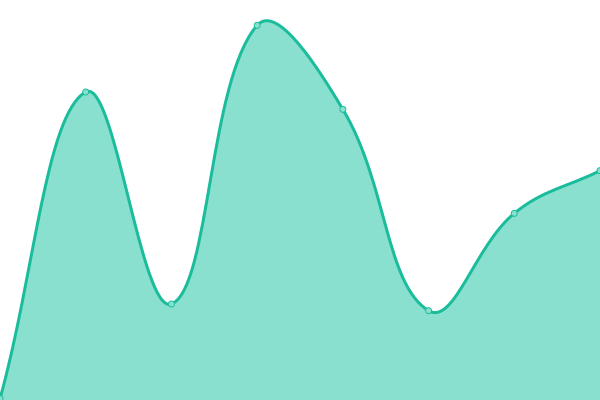
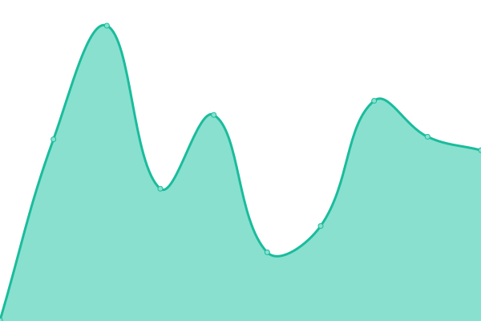
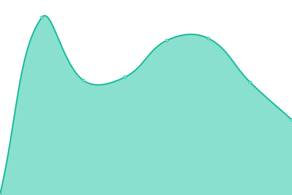

# [📈 Live Status](https://status-01.dataforcanada.org): <!--live status--> **🟩 All systems operational**

This repository contains the open-source uptime monitor and status page for [Data for Canada](https://www.dataforcanada.org), powered by [Upptime](https://github.com/upptime/upptime).

With [Upptime](https://upptime.js.org), you can get your own unlimited and free uptime monitor and status page, powered entirely by a GitHub repository. We use [Issues](https://github.com/dataforcanada/status-01.dataforcanada.org/issues) as incident reports, [Actions](https://github.com/dataforcanada/status-01.dataforcanada.org/actions) as uptime monitors, and [Pages](https://status-01.dataforcanada.org) for the status page.

<!--start: status pages-->
<!-- This summary is generated by Upptime (https://github.com/upptime/upptime) -->
<!-- Do not edit this manually, your changes will be overwritten -->
<!-- prettier-ignore -->
| URL | Status | History | Response Time | Uptime |
| --- | ------ | ------- | ------------- | ------ |
|  [Main Website](https://www.dataforcanada.org) | 🟩 Up | [main-website.yml](https://github.com/dataforcanada/d4c-service-status/commits/HEAD/history/main-website.yml) | 

 201ms
     
 | 

<a href="https://status.dataforcanada.org/history/main-website">100.00%</a>
    

|  [Source Code](https://git.dataforcanada.org) | 🟩 Up | [source-code.yml](https://github.com/dataforcanada/d4c-service-status/commits/HEAD/history/source-code.yml) | 

 273ms
     
 | 

<a href="https://status.dataforcanada.org/history/source-code">100.00%</a>
    

|  [S3](https://s3.dataforcanada.org) | 🟩 Up | [s3.yml](https://github.com/dataforcanada/d4c-service-status/commits/HEAD/history/s3.yml) | 

 219ms
     
 | 

<a href="https://status.dataforcanada.org/history/s3">100.00%</a>
    

|  [S3 Labs](https://s3.labs.dataforcanada.org) | 🟩 Up | [s3-labs.yml](https://github.com/dataforcanada/d4c-service-status/commits/HEAD/history/s3-labs.yml) | 

 200ms
     
 | 

<a href="https://status.dataforcanada.org/history/s3-labs">100.00%</a>
    

|  [Objex Labs](https://objex.labs.dataforcanada.org) | 🟩 Up | [objex-labs.yml](https://github.com/dataforcanada/d4c-service-status/commits/HEAD/history/objex-labs.yml) | 

 172ms
     
 | 

<a href="https://status.dataforcanada.org/history/objex-labs">100.00%</a>
    

|  [SearXNG Labs](https://searxng.labs.dataforcanada.org) | 🟩 Up | [sear-xng-labs.yml](https://github.com/dataforcanada/d4c-service-status/commits/HEAD/history/sear-xng-labs.yml) | 

 238ms
     
 | 

<a href="https://status.dataforcanada.org/history/sear-xng-labs">100.00%</a>
    

<!--end: status pages-->

[**Visit our status website →**](https://status.dataforcanada.org)

## 📄 License

- Powered by: [Upptime](https://github.com/upptime/upptime)
- Code: [MIT](./LICENSE) © [Anand Chowdhary](https://anandchowdhary.com), supported by [Pabio](https://pabio.com)
- Data in the `./history` directory: [Open Database License](https://opendatacommons.org/licenses/odbl/1-0/)
